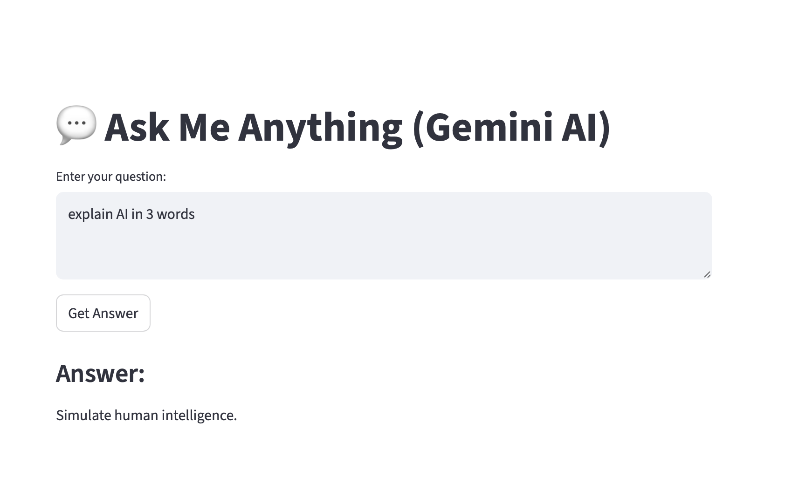

# simple-hello-ai
This is the first simple AI app using Google Gemini API and Streamlit

To see the app in action:
1. Clone the repo
2. Run `pip install -r requirements.txt` to install dependencies
3. Go to `https://aistudio.google.com/apikey` to get an API key and set `GOOGLE_API_KEY` in `.env`
4. Run `python3 main.py` and you should see something like below screenshot

Like I said, it's very simple :)